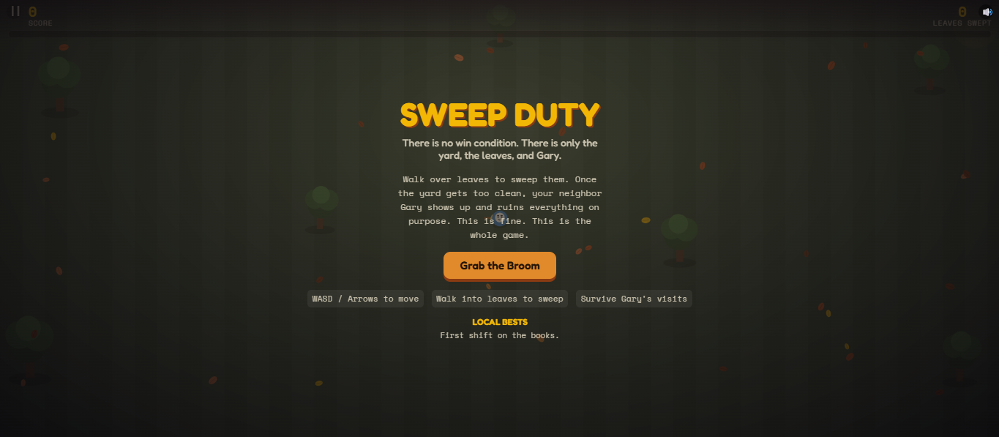
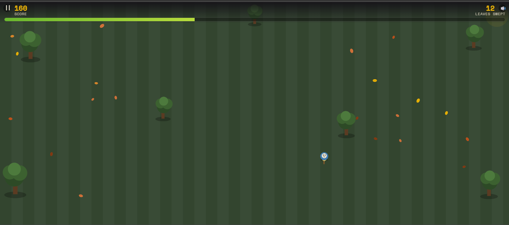
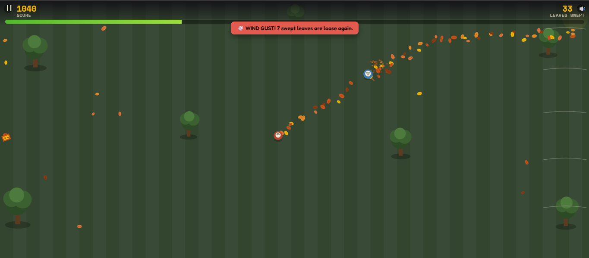
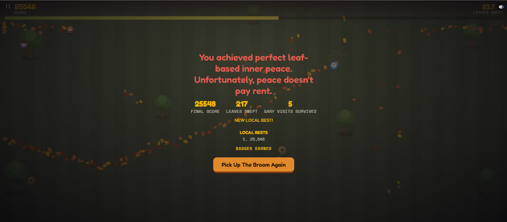

# SWEEP DUTY 🧹🍂

## Basic Details
### Team Name: LFX

### Team Members
- Team Lead:  Mohamed Hafil T - Farook College (Autonomous), Kozhikode
- Member 2: Nihal K - Farook College (Autonomous), Kozhikode

### Project Description
Sweep Duty is a top-down browser game where you sweep leaves off a yard that will never actually be clean, because your neighbor Gary shows up every time you get close and dumps a fresh batch just to spite you. There is no win condition. There was never going to be one.

### The Problem (that doesn't exist)
Nobody has ever needed a video game about raking leaves. Nobody asked for a simulation of the specific rage of finishing a chore only to have a neighbor undo it out of pure spite. And yet, here we are.

### The Solution (that nobody asked for)
We built an infinite, unwinnable leaf-sweeping simulator. A progress bar tracks how clean the yard is, and the moment it crosses a random threshold (75-99%... or lower now, we tuned it), Gary sprints across the screen dropping leaves everywhere while yelling increasingly unhinged one-liners. Occasionally he challenges you to a rake-off duel. Occasionally his wife Dana shows up to yell at him for you. Eventually, after 6-9 of his visits, the game ends with a deliberately stupid, randomly-chosen ending (restraining orders, forced retirement of your broom, achieving leaf-based enlightenment). You get a score. You get nothing else. That's the point.

## Technical Details
### Technologies/Components Used
For Software:
- **Languages:** JavaScript (ES6+), HTML5, CSS3
- **Frameworks:** None — vanilla JS, no build step
- **Libraries:** None — all rendering via HTML5 Canvas 2D API, all audio via the native Web Audio API    (procedurally generated music and sound effects, zero external audio files)
- **Tools:** Google Fonts (Fredoka, Space Mono) via CDN link, browser `localStorage` for high scores and achievements
- **Hosting:** Static site — deployable on GitHub Pages / Netlify / Vercel with zero configuration

For Hardware:
- None — this is a purely software/browser-based project

### Implementation
For Software:
# Installation
No installation or dependencies required — it's a static site.

git clone https://github.com/nihal-firos/neighbourhood-sweeper.git
cd neighbourhood-sweeper

# Run
Just open `index.html` directly in a browser, or play directly using:

https://neighbourhood-sweeper.vercel.app/

### Project Documentation
For Software:

# Screenshots (Add at least 3)

*The title screen — "Grab the Broom" to begin an unwinnable shift.*

*Mid-sweep: leaves scattered across the yard, progress bar climbing toward Gary's threshold.*

*Gary arriving to "help" — his speech banner and a fresh trail of dumped leaves.*

*One of several random, deliberately ridiculous game-over endings.*

# Additional Demos
https://neighbourhood-sweeper.vercel.app/

## Team Contributions
- Mohamed Hafil T: Core game loop, canvas rendering, player/Gary mechanics, progress bar and threshold logic
- Nihal K: Procedural audio (Web Audio SFX and music), UI/HUD design, achievements and high-score system, mobile responsiveness fixes   

---
Made with ❤️ at TinkerHub Useless Projects 

